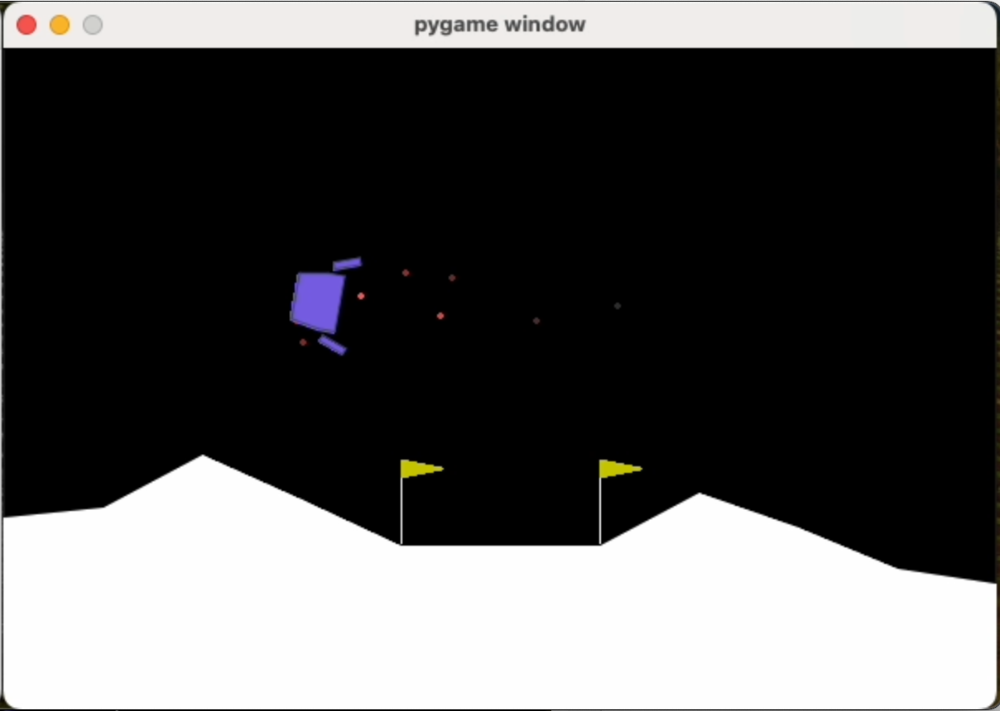
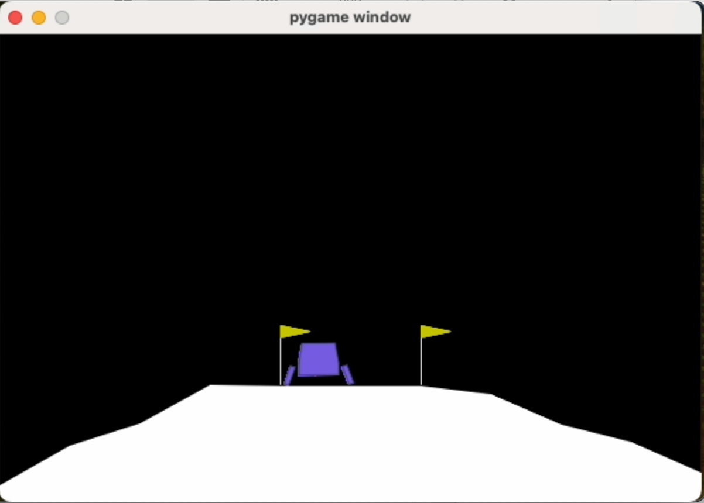

# Lunar Lander Continuous Control with DDPG

This project implements a Deep Deterministic Policy Gradient (DDPG) agent to solve the Lunar Lander Continuous environment from the OpenAI Gym. The agent is trained to control the lander and navigate it to a safe landing on the moon's surface.

### Model Performance Videos

#### Initial Training
During the initial training phase, the agent learns to control the lunar lander through trial and error. Watch as the agent progressively improves its landing strategy:

[](https://github.com/tinytimor/lunar_landar_project_2/raw/main/initial_training_of_ddpg.mp4)

#### Trained Model Evaluation
After training, the agent consistently achieves scores above the target threshold of 250 points per episode, demonstrating successful mastery of the landing task:

[](https://github.com/tinytimor/lunar_landar_project_2/raw/main/evaluation_of_ddgp.mp4)


## Getting Started

### Prerequisites

Ensure you have Python and `pip` installed on your system. You can download Python from [python.org](https://www.python.org/).

### Installation

1. **Clone the repository:**

   Open your terminal and run the following command to clone the repository:

   ```bash
   git clone https://github.com/tinytimor/lunar_landar_project_2.git
   ```

2. **Navigate to the project directory:**

   Change into the project directory:

   ```bash
   cd lunar_landar_project_2
   ```

3. **Install the required packages:**

   Install the necessary Python packages using `pip`:

   ```bash
   pip install -r requirements.txt
   ```

### Running the Code

#### Training and Evaluating the Agent

To train and evaluate the DDPG agent, use the `ddgp_agent.py` script. This script is designed to train the agent on the Lunar Lander environment and evaluate its performance.

- **Training the Agent:**

  Uncomment the training section in the `main()` function of `ddgp_agent.py` to start training:

  ```python
  # Train the agent
  print("Starting Training...")
  scores, avg_scores, total_time = train_ddpg(env, agent)
  env.close()
  print("Training Completed.")
  ```

  Run the script:

  ```bash
  python ddgp_agent.py
  ```

- **Evaluating the Agent:**

  After training, the script will automatically load the trained models and evaluate the agent's performance.

#### Hyperparameter Testing

To test different hyperparameters, use the `ddgp_agent_hyperparameters.py` script. This script allows you to experiment with various hyperparameter settings and track the results.

- **Running Hyperparameter Experiments:**

  Modify the `main()` function in `ddgp_agent_hyperparameters.py` to specify which hyperparameters to test:

  ```python
  # Experiment 1: Learning Rate Critic
  learning_rate_critics = [1e-3, 5e-3, 1e-4]
  run_hyperparameter_experiment('learning_rate_critic', learning_rate_critics)
  ```

  Run the script:

  ```bash
  python ddgp_agent_hyperparameters.py
  ```

### Output and Results

- **Model Checkpoints:**

  During training, model checkpoints are saved in the `ddpg/checkpoints` directory. Final models are saved in `ddpg/final_models`.

- **Experiment Results:**

  Hyperparameter experiment results, including plots and CSV files, are saved in the `ddpg_experiments` directory. Each experiment is stored in a separate subdirectory.

### Differences Between Scripts

- **`ddgp_agent.py`:** This script is used for training and evaluating the DDPG agent. It focuses on a single set of hyperparameters and it is used for running the agent in a standard training loop.

- **`ddgp_agent_hyperparameters.py`:** This script is designed for hyperparameter experimentation. It allows you to test different values for specific hyperparameters and compare their effects on the agent's performance.

By following these instructions, you should be able to set up the environment, run the training and evaluation scripts, and conduct hyperparameter experiments effectively.
